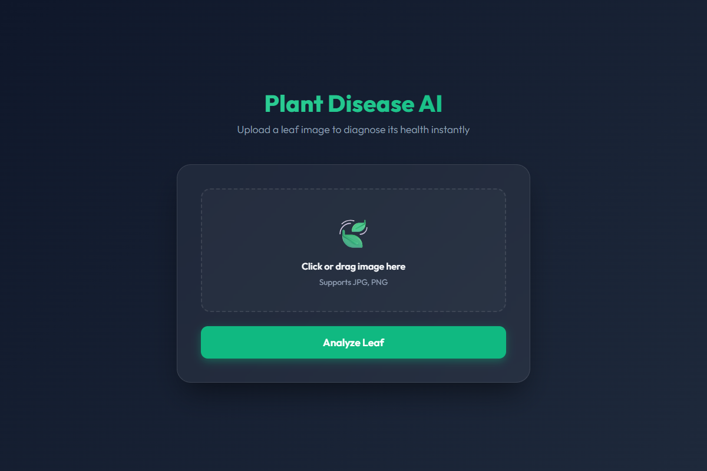

<div align="center">
  
  
  # 🌿 Plant Disease Prediction AI 🌿
  
  <p>
    <b>An AI-powered web application that diagnoses plant diseases from images of leaves.</b>
  </p>
  
  
  
  
</div>

---

<div align="center">
  
</div>

## 🍃 About the Project
This project utilizes a Custom **Convolutional Neural Network (CNN)** trained on the PlantVillage dataset to accurately classify leaf diseases. It provides an instant diagnosis and a confidence score, all wrapped in a sleek, modern, glassmorphism UI! 🌱

## 🚀 Features
- 🌲 **Instant Diagnosis**: Upload an image of a leaf and get a real-time prediction of its disease or health status.
- 🎯 **High Accuracy**: Powered by a custom-trained CNN built with TensorFlow/Keras.
- 🎨 **Modern UI**: Features a sleek, responsive, dark-mode glassmorphism interface with smooth micro-animations.
- 📊 **Confidence Metrics**: Displays the AI's confidence percentage for every prediction.

## 🛠️ Tech Stack
- **Deep Learning**: TensorFlow, Keras, NumPy 
- **Backend**: Python, Flask
- **Frontend**: HTML5, Vanilla CSS (Custom Glassmorphism Theme)

## 📂 Project Structure
```text
├── app.py                             # Main Flask application and API routing
├── mango_leaf_disease_prediction.py   # Script to train and generate the CNN model
├── mango_leaf_disease_model.h5        # The trained deep learning model
├── templates/
│   └── index.html                     # Modern frontend UI
└── static/
    └── uploads/                       # Temporary storage for user-uploaded images
```

## ⚙️ How to Run Locally

**1. Clone the repository**
```bash
git clone https://github.com/RaghavSdev/plant-disease-detector.git
cd plant-disease-detector
```

**2. Install dependencies**
```bash
pip install flask tensorflow numpy matplotlib
```

**3. Train the model (Optional)**
*Note: If you already have the `mango_leaf_disease_model.h5` file, you can skip this step.*
Place your dataset in a folder named `plantVillage` in the root directory, then run:
```bash
python mango_leaf_disease_prediction.py
```

**4. Start the Web Server**
```bash
python app.py
```
The application will start running at `http://localhost:3001`!

<div align="center">
  
  <p><i>Keep your plants healthy!</i></p>
</div>
